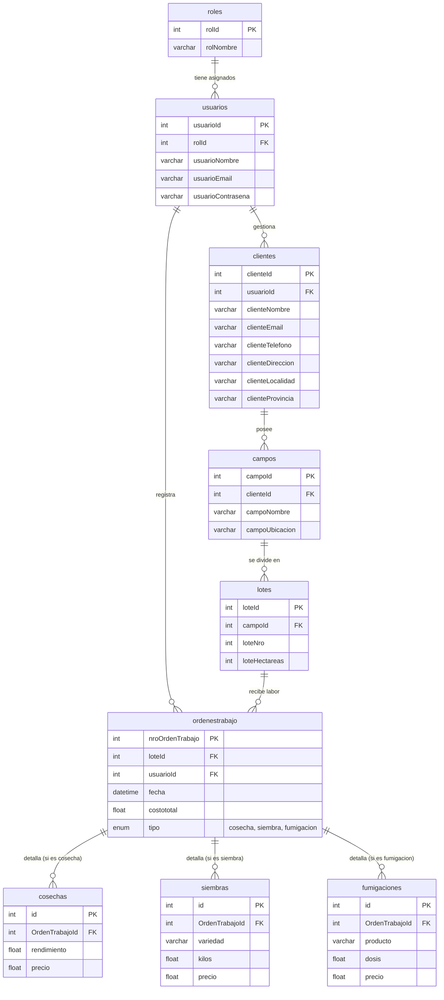

# tp-dsw-agro
TP Desarrollo de Software - Agro
- Molinari Andrés - 43700 

Aplicación de gestión de trabajos del sector agropecuario para la materia Desarrollo de Software de la UTN Frro.  

Toda la documentación completa se encuentra aquí: [docs/README.md](docs/README.md)  

## DER

## Regularidad

| Tipo             | Descripción                                                                                       |
|------------------|---------------------------------------------------------------------------------------------------|
| **CRUD Simple**  | CRUD Cliente CRUD Campo                                                                        |
| **CRUD dependiente** | CRUD Lote depende de Campo                                                                    |
| **Listado**      | Listado de trabajos realizados, filtrado por tipo de trabajo. Mostrando los detalles de los trabajos |
| **CUU/Epic**     | Nuevo Trabajo                                                                                     |

## Aprobación Directa

| Tipo             | Descripción                                                                                       |
|------------------|---------------------------------------------------------------------------------------------------|
| **CRUD Simple**  | CRUD Cliente CRUD Campo                                                                        |
| **CRUD dependiente** | CRUD Lote depende de Campo                                                                    |
| **Listado**      | Listado de trabajos realizados, filtrado por tipo de trabajo. Mostrando los detalles de los trabajos |
| **CUU/Epic**     | Nuevo Trabajo Facturación y Cobranza                                                           |
